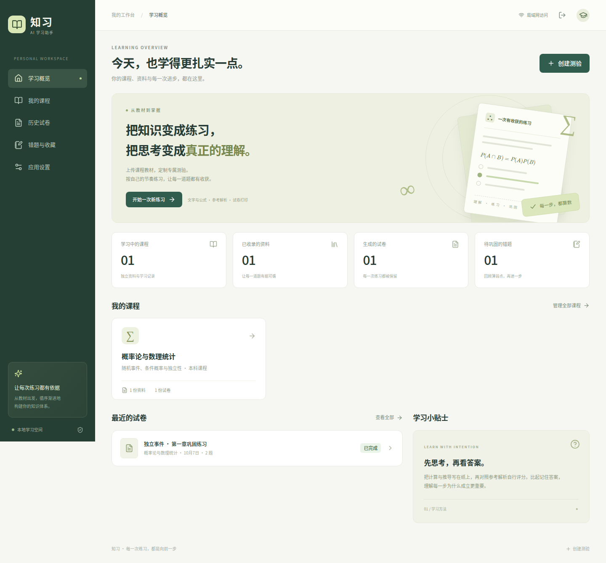

# 知习 · AI 学习助手

从你自己的 PDF 教材出发，通过 DeepSeek 生成数学课程练习，支持在线查看、纸上作答、自行评分和试卷打印。面向个人的本科离散数学、概率论等课程学习。

**电脑运行服务，手机与电脑连接同一 Wi-Fi 后通过浏览器使用。无需租服务器。**



界面截图使用端到端测试的示例课程和模拟题目，不代表真实 DeepSeek 出题质量。[查看手机练习界面](docs/images/exam-mobile.png)。

## 第一版功能

- 多课程独立资料库，PDF 上传、目录书签、按页预览和文本修正。
- 扫描 PDF 按页识别中文与 LaTeX 公式，原图对照、手动校对、进度与失败重试。
- 按教材、章节或 PDF 页码范围出题；自定义题型／随机搭配。
- 选择、判断、填空、计算、证明题；题量、分值、难度、用时和侧重点可调。
- DeepSeek 逐题生成答案、步骤解析、评分要点和资料来源页码。
- 后台生成进度、暂停、失败重试、重启后恢复入口；已完成题目保留。
- 单题编辑、删除、重新生成，历史试卷保存。
- 在线简短作答／纸上作答、自评分、评分历史快照、错题和收藏。
- 规划草稿自动保存与修改记录，刷新后恢复设置及分配表，后台规划重新连接进度。
- 选择、判断、结构化填空题点击“保存作答”后自动核验并保存分数，不调用模型；支持人工改分。
- 重新作答会清空当前答案与评分，同时保留错题标记和历史记录。
- LaTeX 公式显示；学生试卷与参考答案分别打印／保存 PDF。
- 本地 SQLite、访问口令登录、后端保存 API Key。

## 快速开始

先安装 **Python 3.11+、Node.js 22 LTS+、Git**。

```bash
git clone https://github.com/e2219/Self-learning-test.git
cd Self-learning-test
python start.py
```

macOS/Linux 若 `python` 不存在，使用 `python3 start.py`。Windows 可以使用 `py start.py`。

启动脚本会创建 `.venv`、安装依赖、构建前端并启动应用。首次启动需要联网下载依赖；以后仅在相关文件变化时重新安装或构建。

终端将显示：

- 电脑地址：`http://localhost:8000`
- 手机地址：例如 `http://192.168.1.5:8000`，以实际终端输出为准。
- 访问口令：首次随机生成，保存在本机 `data/access-code.txt`。

使用流程：

1. 浏览器打开地址，输入口令。
2. 在「应用设置」中填写自己的 DeepSeek API Key 并保存。
3. 在「我的课程」创建课程、上传 PDF。扫描教材或异常文字点击「文字与公式识别」，自动保存读取结果；原文对照与修正可选。
4. 点击「生成测验」，选资料和页码、题型、题量、分值与难度。
5. 生成后在线练习，或者点击「打印试卷」，在浏览器打印对话框中选择「另存为 PDF」。
6. 选择、判断与结构化填空题点击“保存作答”后自动评分并记入记录；其他题型展开参考答案后自行评分。需要改分时仍可展开参考答案手动调整。已评分且未满分的题目进入错题本，满分后移出，也支持手动标记。

打印时建议使用 **A4、缩放 100%、关闭浏览器自带页眉和页脚**。复杂计算和证明预留纸上作答空间。

## 扫描教材与公式 OCR

已上传的扫描教材无需重新上传。更新并重启后，在课程资料卡点击 **文字与公式识别**，或在出题页选好页码后点击 **识别所选页**。

1. 选择所需页码或点击“选择整份资料”。默认每个识别任务最多 2000 页，与 `STUDY_MAX_PDF_PAGES` 保持一致；后台每次只处理一页，并非把整本书作为一个请求上传。页码按 PDF 实际页序。
2. 点击 **开始识别**。复用现有 DeepSeek API Key，使用支持图片输入的 `deepseek-flash`；无需安装本地大模型、CUDA 或购买额外 OCR 服务。首次更新会自动安装 PDF 页面渲染依赖。
3. 按页查看进度；关闭弹窗后仍在电脑后台执行，重新打开会显示最近任务。停止操作在当前页请求结束后生效。识别失败会停止后续调用，点击 **重试未完成页** 继续，已完成页保留。服务重启后同样可重试。
4. 完成后点击 **完成，返回出题**，结果自动进入检索与出题流程。**查看原文与读取结果（可选）** 默认收起，发现问题时再展开修正。

默认复用未发现明显异常的 PDF 文本和已有 OCR 结果；开始识别时，明显逐字断行、含乱码或正文不足的原始文本不会因字符数多而跳过。此判断不能发现所有缺字或公式错误。窗口会标明内容来自 PDF 文本层、AI 图片识别还是手动修正。文字层公式提取不完整时，可点击 **仅重新识别当前页（调用 API）**，或勾选 **重新识别已有文字的页面** 后识别指定范围。人工修正过的页面始终保留，包括识别过程中保存的修正。空白页即使识别完成也可能没有足够正文用于出题。

本功能会将选定页渲染成图片发送给 DeepSeek，按 API 用量计费，**不会上传整份 PDF**。图片在请求期间留在内存，识别文本与任务进度保存到本机 SQLite。任务 token 数累计接口已报告的用量，包括返回正文校验失败的请求；未报告用量或超时的调用也可能产生费用，以服务商账单为准。旧版本失败记录中的 0 tokens 无法追溯补计。无需对整本几百页教材一次性识别，后续出题会复用识别结果。

这是通用视觉模型的转写能力，无法保证复杂公式、密集小字、模糊扫描或多栏页面准确。无法辨认的内容会提示核对；图形不转写。官方说明：[DeepSeek 图片输入](https://api-docs.deepseek.com/guides/vision/)。项目暂未部署需要 GPU 的独立 DeepSeek-OCR 开源模型。

如果旧任务提示「识别结果格式异常」，先停止服务，执行 `git pull --ff-only` 和 `python start.py` 更新重启，再点击原任务的 **重试未完成页**，不必重新上传教材。新版本直接接收 Markdown／LaTeX，避免将公式嵌入 JSON 时的反斜杠转义问题；空响应、内容截断、接口结构异常会分别给出诊断码。诊断日志不包含教材正文或密钥。

### 开启代理时识别失败／显示 0 tokens

项目通过后端调用真实 DeepSeek API。若终端启用了 SOCKS5 代理，旧依赖 `httpx` 缺少 SOCKS 支持，会在请求发出前触发 `ImportError`，并被旧版显示为通用失败。现已改为 `httpx[socks]`，OCR 与出题共用代理客户端；不会自动绕过代理或关闭证书校验。

更新时先关闭服务，运行 `git pull --ff-only`、`python start.py`，启动器会安装新增依赖。若手动管理环境，需要在**实际运行服务的 Python 环境**中安装 `requirements.txt`。

在「应用设置」点击 **检查 DeepSeek 连接**，会使用已保存密钥读取 `/models`，不发送教材、不调用生成接口。连接成功不代表图片识别内容一定正确。失败时会明确区分缺少代理依赖、代理地址配置无效、网络／证书错误和 HTTP 错误。支持标准 `http://`、`https://`、`socks5://`、`socks5h://` 代理地址，非标准 `socks://` 会提示修改。

OCR 任务逐页显示调用阶段及已收到的 HTTP 状态。**0 tokens 仅表示尚未记录到用量**；客户端初始化失败说明请求尚未开始，进入请求步骤但没有响应则不能判断服务商是否收到。旧任务没有阶段记录，需重试后查看。其他内部异常会显示异常类型，终端输出 `OCR diagnostic ...` 安全诊断行，不包含密钥、代理账号密码或教材原文。

## 手机连接

电脑需要保持开机，应用终端保持运行。手机与电脑须能互相访问：

- 连接同一个 Wi-Fi，打开终端显示的局域网地址；手机不能使用 `localhost`。
- 系统防火墙需允许 Python / 8000 端口在家庭或私人网络上接收连接。
- 校园网、访客 Wi-Fi 可能开启设备隔离，即使同 Wi-Fi 也无法连接；可改用个人路由器或手机热点。
- 浏览器支持响应式阅读、简短答案输入、自评分；不是独立手机 App。

## 运行配置

可选环境变量：

| 变量 | 默认值 | 用途 |
| --- | --- | --- |
| `DEEPSEEK_API_KEY` | 应用设置中的密钥 | 环境变量优先，不会在界面返回密钥内容 |
| `STUDY_ACCESS_CODE` | 首次随机生成 | 自定义访问口令，至少 8 个字符 |
| `STUDY_DATA_DIR` | 项目下的 `data` | 本地资料、数据库、初始口令保存位置 |
| `STUDY_PORT` | `8000` | HTTP 服务端口 |
| `STUDY_MAX_PDF_MB` | `1024` | 单份 PDF 大小上限，单位 MB（按 1024² 字节计算） |
| `STUDY_MAX_PDF_PAGES` | `2000` | 单份 PDF 页数上限 |

`.env.example` 仅用于说明环境变量，程序**不会自动加载 `.env`**。普通使用不需要创建此文件，直接在设置页配置 API 即可。

通过环境变量修改访问口令后，旧会话会在最多 7 天后失效；如需立即撤销所有会话，关闭应用后执行：

```bash
# 使用同一运行环境和 STUDY_DATA_DIR
.venv/bin/python -c "from backend import db; db.execute('DELETE FROM sessions')"
```

Windows 将 `.venv/bin/python` 替换为 `.venv\Scripts\python.exe`。

**备份**：先关闭应用，再复制整个 `data` 目录。恢复时保持相同目录结构。`data/`、`.env`、教材、密钥和学习记录均被 Git 忽略。API Key 在本机数据库中保存，数据库并未加密；请保护自己的电脑账户和备份。局域网版本使用 HTTP，不应直接暴露到公网。

## 出题与解析的边界

- **真实 API**：生产应用调用 `https://api.deepseek.com/chat/completions`，不自动回退到假题目。调用产生 DeepSeek API 费用。
- **检索**：新卷先规划考点，再按已确认的原文证据出题；历史未规划卷继续采用关键词／中文双字匹配和范围内抽样。每题最多约 14,000 字符上下文，未使用向量数据库，不保证覆盖范围内所有知识点。建议一次选一个章节。
- **PDF**：支持文字型与扫描型 PDF，默认每份最多 **1024 MB（1 GB）、2000 页**，可用上述环境变量调整，重启服务后生效。前端显示并遵循后端配置。文件分块保存、从磁盘文件流读取，避免应用把原文件整体读入内存；解析 PDF 对象、解压页面内容仍会消耗内存。上传时显示传输进度，完成传输后显示保存／解析状态。大型教材可能需要数分钟，请保持页面打开。框架会先把上传内容暂存到磁盘，导入期间临时目录和资料目录合计可能占用约两倍文件大小的磁盘空间。扫描页支持按需 OCR；图形和图像题暂不支持转写。PDF 书签存在时才有章节目录。公式、上下标可能提取失真，应检查并修正。
- **页码**：全部为从 1 开始的 PDF 实际页序，不等同于印刷页码。
- **题目**：第一版为 AI 新编题；往年试卷可作为参考材料，尚未实现原题自动切分和抽取。
- **检查**：验证字段、题型结构、答案格式、来源与重复，再进行独立模型审题和解析核对；仍无法保证学科事实、数学结论、证明或难度绝对正确，不是形式化验证器。
- **评分**：选择、判断和带逐空标准答案的填空题支持本地字面核验，不调用 AI，不验证参考答案是否正确；点击“保存作答”时同时计算并保存分数。计算、证明和旧版未结构化填空题仍自行评分。历史评分保存题目快照，题目重新生成后仍可回看；删除题目会一并删除对应记录。
- **失败**：已有题目逐题写入数据库；暂停会等待当前 API 调用结束。重启后未完成题目标记为失败，可手动继续。未完成试卷打印时仅输出已完成题目，并重新计算总分。
- **计量**：出题 token 数累计接口已报告的用量，包括自动重试和最终校验失败的调用；未报告用量、连接中断等调用也可能产生费用，实际账单以 DeepSeek 为准。旧版本失败调用无法追溯补计。

## 降低重复题和格式失败

- 生成时提供已有题目的题干、选项和知识点；从当前参考资料中优先选择与已出题内容重合较少的片段，并分配不同出题角度。片段选择使用本地词语匹配，不能保证语义层面的全面覆盖。
- 判重不再使用「题干相似度超过 90%」的全局阈值。同题型按规范化题干比较，选择题还比较选项内容（忽略选项顺序）。同样的通用题干配不同选项、填空题中数字／不等号／条件改变，不会仅因文字相似就被拦截；仅改变答案不能让相同题目通过。措辞不同的语义重复仍可能漏检，不能替代人工审阅。
- 重复、JSON 格式、字段结构、选项、引用页码及公式控制字符等校验失败时，将具体原因和上次失败的输出反馈给模型自动调整，**每题最多 3 轮，每轮最多包含生成、独立解题、解析核对三次调用**。遇到重复会重新选择资料中的出题重点；失败用量也纳入统计。
- 密钥、余额、限流、网络错误和资料不足不会进入上述内容重试循环；暂停后不再发起下一轮调用。已完成题目保留。
- 兼容完整 JSON 代码围栏、明确的 A/B/C/D 选项对象、小写答案字母等可无歧义转换的表达。不猜测缺失字段或自动补造答案。

更新后，原有未完成试卷可直接点击 **继续 / 重试**，无需重新 OCR 或创建整张试卷。每道题的自动重试可能增加等待时间和 API 用量。

使用时建议按章节分批出题，先确认所选范围有足够且正确的解析文字；在「重点知识或学习目标」写出几个具体知识点。若有效资料只有少量定义，应减少同类题数量或扩大有效页码范围，不要用很窄的内容强行生成大量题目。

## 开发与验证

```bash
python -m venv .venv
.venv/bin/python -m pip install -r requirements-dev.txt
.venv/bin/python -m pytest -q

cd frontend
npm ci
npm run build
npx playwright install chromium
npm run test:e2e
```

测试使用临时目录，不接触真实教材、数据库或 API Key。端到端测试明确使用 `tests/browser_server.py` 中的模拟生成函数，覆盖真实上传、扫描页 OCR 工作流（模拟视觉响应）、原图校对、缓存复用、解析修正、组卷界面、作答、自评分、错题、收藏、桌面／手机尺寸和分离打印。**模拟测试不代表已验证真实 DeepSeek 命题质量。**

仓库提供 [GitHub Actions 工作流模板](docs/ci-workflow.example.yml)，可在推送和 PR 时执行后端测试、前端构建和浏览器端到端测试，并保存截图及测试 PDF。**当前尚未启用自动 CI**：开发环境的 GitHub 令牌缺少 `workflow` 权限，GitHub 拒绝上传 `.github/workflows/ci.yml`。使用具有该权限的凭据，或在 GitHub 网页中将模板保存到该路径，即可启用。

当前版本已完成 144 项后端测试、4 条浏览器完整流程，并完成真实 DeepSeek 图片接口及连续出题测试；此前也已完成 512 MB 合成 PDF 上传验证；第一版另有 1 次真实 DeepSeek 小题调用记录，详见 [核验记录](docs/VERIFICATION.md)。

需要复现大文件上传验证时，在项目根目录执行 `.venv/bin/python scripts/verify_large_upload.py`。该脚本会生成 512 MB 合成 PDF，在独立临时数据目录和随机本机端口验证上传、保存与提取，然后自动清理，不接触个人学习记录、不调用 AI。合成文件只有 1 页内容，不能用来预测真实复杂教材的解析性能。

开发热更新：

```bash
# 终端 1，项目根目录。先运行一次 python start.py 获取口令，或设置 STUDY_ACCESS_CODE。
.venv/bin/python -m uvicorn backend.main:app --host 0.0.0.0 --port 8000 --reload
# 终端 2
cd frontend
npm run dev
```

开发时从 Vite 地址访问，`/api` 会代理到 8000。正常使用由 `run.py` 在同一端口提供 API 和构建后的前端，**只运行一个服务进程／一个 worker**。

## 目录

```text
backend/       FastAPI、SQLite、登录、PDF 解析、检索、DeepSeek 生成
frontend/src/  React + TypeScript 界面、KaTeX、响应式样式与打印布局
tests/         后端用例与显式模拟的浏览器测试服务
frontend/e2e/  Playwright 完整学习流程
docs/          已确认需求、验证说明
start.py       安装、构建与启动入口
run.py         已安装环境下直接启动
data/          本地运行数据（不提交）
```

### 出题质量校验

新题会按课程名称和简介适配学科。可选贴近原题、适度变式、情景应用。填空题使用编号空位和逐空答案（含等价答案）。每题先独立解题，再核对参考答案、解析与资料；单选多个正确项、依据不足、题型不符或语义重复会被拒绝并尝试修订。最多三轮，每轮最多三次 API 请求，所有已报告用量计入试卷。AI 审题仍可能出错，不能代替人工核对。历史题目不会被自动重写；重新生成后才使用新流程，人工编辑会清除原审题通过状态。

### 表格资料核对

AI 图片读取的表格在通过结构检查后自动参与出题，无需逐页人工确认；这不代表数据经过人工验证。PDF 文本层中的未确认表格会在启动识别时调用图片读取，避免直接复用错乱行列。人工修正的表格以及主动标记有问题的页面仍保留核对要求。请在“预览与修正”或 OCR 窗口对照原图核对表头、行列、单位与脚注；列数不一致或有无法辨认标记时须先修正。确认后整页作为资料块保留，避免切断表格。再次编辑或整页识别会撤销确认。检测只是启发式，漏检时可手动标为表格。局部高清识别按页面百分比选择区域，只返回草稿及 API 用量，不覆盖页面；请手动合并。结构检查不能判断所有数字是否识别准确，也不会擅自修正数据。

### 考点规划与覆盖

创建测验时先点击“生成考点分配表”，检查每题的考点与设问目标，然后“确认分配并生成测验”。可展开查看全部候选考点、原文依据与尚未覆盖的主题。修改页码、课程、题型、难度、重点或出题方式后需重新规划；更改试卷名称和用时无需重新规划。服务端会核对资料指纹，防止使用过期的分配表。历史试卷仍可继续/重试，不强制重新规划。

规划分批读取范围内的可用文本，单次最多 12 万字符，超过时要求按章节缩小范围，不静默丢弃后半部分。每批最多提取 12 个主要主题；模型选择程序编号的原文片段，引用由程序从原文填入。自动合并同名主题，按显式重点匹配、习题集/往年试卷及学习目标线索分配题量。这是建议分配，不代表已知教师考试重点；可手动选择候选主题并调整设问目标。语义重复由独立审题辅助检查，不是严格语义证明。

规划与出题用量分别显示；规划失败的已报告用量保留。可停止后续规划，当前调用仍会完成并可能计费。规划结束后按所分配的原文证据出题，普通文本不再任意扩展到同页其他主题，核对过的表格仍整页保留。待核对表格页和文字不足页会列为排除项。试卷详情显示分配数、完成数与未覆盖主题；统计针对提取出的候选主题，不能宣称覆盖整个教材的所有细节。

### 规划恢复与防重复提交

返回生成页面后，选择“继续上次规划”可恢复本课程最近一次规划的资料范围、题型、重点、用时及分配表。后台仍在规划时仅重新查询进度，不会再次调用模型。电脑服务必须继续运行；重启导致中断的规划会标为失败，可重新规划并复用已完成的考点缓存。

完成后的分配表和设置自动保存到电脑数据库，并记录历史版本。短暂断网时输入保留在当前浏览器；刷新后可选择恢复本机修改或使用服务器已保存版本。多页面同时修改会检查版本冲突，不静默覆盖。更改规划依据后，旧草稿与记录仍保留，并提示“依据已变化”；必须核对资料并重新规划才能生成。新规划的修改记录也可查看前一份规划。

生成试卷使用持久化提交标识和数据库事务去重；重复点击、网络重试会返回同一份试卷，同一规划只能提交一次。已提交规划提供试卷入口，需要另一份试卷时重新生成分配表。删除原试卷不会解除旧提交的去重限制。

### 不调用模型的答案核验

选择、判断题比较标准选项；填空题逐空比较标准答案和明确列出的等价答案。忽略首尾空白及最外层公式定界符，保留大小写、正负号和公式内部字符。比如标准答案仅有 `1/2` 时，不会自行推断 `0.50` 等价；需要把它列为可接受答案，或人工给分。结果区分“一致”“不一致”和“未作答”，不把未作答直接标成错误。参考答案本身仍需人工核对。

点击“保存作答”会在同一次操作中保存答案、评分和历史快照，并更新错题状态，无需再检查或采用建议分数。填空题按空位等分，分数保留两位小数，部分未填的空位不得分；全部未作答时保存为空作答、暂不评分，不新增评分记录。重复保存相同答案与分数不会重复添加自动评分记录。仍可展开参考答案后人工改分。旧版没有逐空答案的填空题、计算和证明题保留自行评分。

### 节省 token

- OCR 继续复用已有文字；出题无需重复识别同一资料。
- 考点按资料文本、资料类型、课程说明、请求模型和提取规则版本缓存。重复规划只分析未命中的资料片段；改变题数、分值或重点可本地重新分配已有考点。
- 规划请求只发送一份编号原文证据，避免在资料列表和证据列表中重复发送正文。
- 草稿恢复、进度重连、修改记录及本地答案核验不调用模型；试卷提交去重避免重复生成。
- 保留独立审题流程，不通过跳过审题来节省用量。首次规划、资料变化后的重新提取及实际出题仍会计费；缓存命中数和本次规划 token 数在分配表中显示。

实际节省幅度取决于缓存命中与资料变化情况。缓存复用不意味着提取出的考点完整无误，仍须检查覆盖范围、原文依据和分配表。实际 OCR 精度、审题准确率仍需用课程真实错题积累评测样本。

### 图片读取与页数限制

目前利用 DeepSeek Flash 原生图片输入读取页面，内部保留 Markdown/LaTeX 缓存用于检索、考点规划和引用，并不是每次出题都重新发送全部图片。正常文本复用不消耗 OCR tokens；希望全部按图片读取时，勾选“重新识别已有文字的页面”（人工修正仍保留）。

默认识别队列上限 2000 页，可通过 `STUDY_MAX_PDF_PAGES` 调整后重启；这不是模型单次请求可处理的 PDF 页数。官方图片接口另有每请求最多 600 张图片、请求体 48 MiB 等限制，本项目逐页请求。大任务会增加时间与费用，可停止并恢复。识别上限也不是组卷上限：当前考点规划仍有 120000 字符的资料预算，超过时应按章节分卷。

### 精简答案输出

新出题不再要求模型生成评分要点，答题页、编辑窗口和答案打印也不再展示该部分；历史数据保留以兼容旧试卷。客观题解析要求简洁，计算和证明题保留必要推导，答案字段集中给出结论。独立解题及一致性审查仍保留，未降低质量校验要求。此调整没有固定节省比例，用量受资料长度、审题与重试次数影响。
