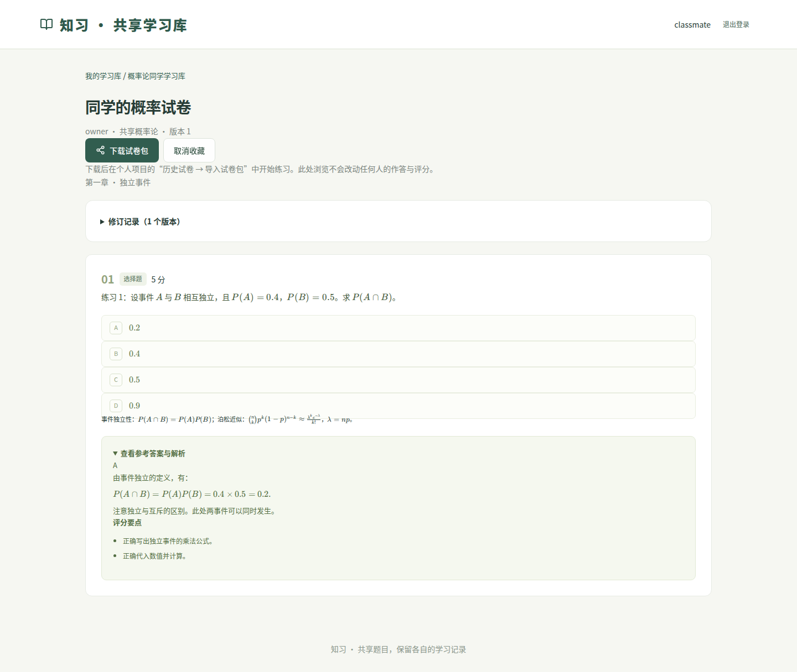

# 共享学习库：使用与部署

学习库是独立的互联网服务，账号登录后输入学习库邀请码加入。支持发布试卷／错题包、浏览公式与答案、按标题／课程／发布说明搜索、收藏、下载、修订历史，以及创建者、管理员分级管理成员和下架内容。

个人学习助手仍在每位同学的电脑运行。共享库不提供 AI 出题，也不接收个人 API Key、原教材 PDF、作答、分数或错题标记。云端只存账号、学习库成员及主动发布的题目内容。**本版本提供了服务代码与部署配置，尚未部署到真实公网服务器。**



截图来自模拟数据浏览器测试。[查看手机页面](images/shared-library-mobile.png)。

## 使用流程

1. 在自己的个人项目中生成并核对题目。
2. 在试卷页点击 **导出试卷包**，导出已完成题目；单题右上角可单独导出。在错题／收藏页可导出当前筛选下的前 30 题。
3. 打开管理员部署的共享库网址，注册自己的账号（用户名 3–32 位英文字母、数字或下划线，密码至少 10 位）。管理员若设置了站点注册口令，注册时一并填写。
4. 创建学习库，保存并分享一次显示的邀请码；其他同学登录自己的账号后输入此码加入。站点注册口令和学习库邀请码用途不同。
5. 选择个人端导出的 JSON 试卷包，检查发布前预览，填写章节／考点／修订说明，点击 **确认发布到学习库**。浏览不需要下载原教材。
6. 同学可以直接查看题目和参考答案、收藏、下载试卷包。需要作答时，在自己的个人项目 **历史试卷 → 导入试卷包** 中导入。自动生成一份新试卷，独立保存自己的答案、评分和错题记录。
7. 发布者可以上传修订包，保留旧版本；其他人已经下载或导入的副本不会自动改变。所有角色只能修订自己的发布；发布者、创建者或管理员可以删除发布。
8. 创建者和管理员可以更换邀请码，旧码立即失效，已加入成员保留。移除成员后，其原有登录也不能再读取该库、下载或上传；恢复成员资格后才能重新访问。

第一版仅支持本项目格式的 JSON 试卷包，**不支持直接上传 PDF/Word 作为可答题试卷，不包含共享库内在线作答或实时协作编辑**。选择、判断、填空等题目按原题型保留；复杂公式通过 KaTeX 显示。题目和参考答案不因发布而自动获得“正确”保证。

个人端导入卷未附原教材，不支持重新生成或修改题目内容；可以练习、评分、收藏、查看历史和打印。如果需要修正题目，请发布者在原个人项目修改后发布新版本，再下载导入。

## 三级角色与管理入口

每个学习库独立划分角色。同一个账号可以是甲库的管理员、乙库的普通成员；通过邀请码加入时默认是普通成员。

| 操作 | 创建者 | 管理员 | 普通成员 |
| --- | --- | --- | --- |
| 查看资料、参考答案和修订历史 | ✓ | ✓ | ✓ |
| 上传、收藏、下载试卷／错题包 | ✓ | ✓ | ✓ |
| 修订或删除自己的发布 | ✓ | ✓ | ✓ |
| 删除他人的发布 | ✓ | ✓ | — |
| 移除／恢复普通成员 | ✓ | ✓ | — |
| 更换学习库邀请码 | ✓ | ✓ | — |
| 任命、取消或移除管理员 | ✓ | — | — |

创建者进入学习库，展开 **成员与邀请码**，点击成员旁的 **设为管理员**；之后可点击 **取消管理员**，将其恢复为普通成员。管理员不能变更创建者、其他管理员或自己的角色。创建者身份暂不支持转让或移除。

权限在服务端逐次核验，取消管理员或移除成员后，原有登录立即失去对应权限。恢复被移除的账号时先恢复为普通成员；如需管理员权限，由创建者另行任命。移除成员不会自动删除其发布，管理者可另外清理内容。删除发布也不会收回已经下载的副本。

已有学习库的原创建账号直接显示为“创建者”，原普通成员身份保留，无需重新建库或迁移数据。此处的“管理员”仅管理所属学习库，不等同于部署服务器的站点运维人员。

## 先在本机试用

已有完整个人项目开发环境时，在项目根目录执行：

```bash
npm ci --prefix frontend
npm run build --prefix frontend
LIBRARY_COOKIE_SECURE=false .venv/bin/python -m uvicorn backend.library.main:app --host 127.0.0.1 --port 8001
```

打开 `http://127.0.0.1:8001`。这不会启动个人端，也不会使用个人端的访问口令或数据库。共享库数据默认在 `library-data/`，个人资料仍在 `data/`。二者均被 Git 和 Docker 构建上下文忽略。

`LIBRARY_COOKIE_SECURE=false` 仅用于本机 HTTP 测试；公网使用下述 HTTPS 部署。只需共享库依赖时可安装 `requirements-library.txt`，不需要 PDF/OCR 依赖。

## 准备服务器与域名

适合先给一个学习小组使用。可从 Linux、约 2 GB 内存的小型服务器起步；实际容量取决于使用人数、题目长度和访问量。前端构建也需要内存，不能据此保证承载人数。服务器安装 Docker Engine 和 Compose 插件；准备一个域名或子域名，将其 A 记录指向服务器公网 IPv4。若设置 AAAA，也必须指向实际可访问的 IPv6 地址。

开放 TCP 80、443，SSH 端口按服务器设置管理。应用的 8001 端口仅在 Docker 内网供 Caddy 使用，不直接映射到公网。不要将个人端的 8000 端口或 `data/` 目录用于此部署。

是否需要备案取决于服务器所在地和服务商要求，购买时按服务商说明办理。

## 使用 Docker Compose 上线

在服务器克隆项目后：

```bash
git clone https://github.com/e2219/Self-learning-test.git
cd Self-learning-test
cp deploy/library.env.example .env.library
```

编辑 `.env.library`：

- `LIBRARY_DOMAIN` 填实际域名，例如 `study.your-domain.com`，不含协议或路径。
- `LIBRARY_REGISTRATION_CODE` 建议改成自己的长随机注册口令，仅发给需要注册的同学；留空则允许任何人注册，但仍须持学习库邀请码才能加入和查看内容。

然后启动：

```bash
docker compose --env-file .env.library -f deploy/compose.library.yml up -d --build
docker compose --env-file .env.library -f deploy/compose.library.yml ps
docker compose --env-file .env.library -f deploy/compose.library.yml logs --tail=100
```

Caddy 会申请并续期 HTTPS 证书。DNS 和 80/443 可达后，打开 `https://你的域名`。如果无法签发证书，先检查域名解析、安全组和 Caddy 日志。请勿把密码、注册口令或完整环境配置贴到公开 issue。

第一次注册不会自动成为其他学习库的管理员；每个学习库由其创建者管理。账号密码使用独立盐哈希，登录令牌只在数据库保存哈希。Cookie 默认仅经 HTTPS 发送，修改密码会使该账号全部旧会话失效。

容器以普通用户运行。共享库使用 SQLite 和一个应用 worker；不要将同一数据库挂载给多个应用副本，也不要增加 workers。当前提供的是小组使用版本，并非经过压测的大规模社区服务。

## 升级与备份

更新代码前备份，然后：

```bash
git pull --ff-only
docker compose --env-file .env.library -f deploy/compose.library.yml up -d --build
```

数据保存在 Compose 的 `library_data` 命名卷中，普通重新构建不会删除。**不要使用 `docker compose down -v`，它会删除命名卷。**

一致性备份可以先停止应用再复制数据库：

```bash
docker compose --env-file .env.library -f deploy/compose.library.yml stop library
mkdir -p backups
docker compose --env-file .env.library -f deploy/compose.library.yml cp library:/var/lib/zhixi-library/. backups/library-data
docker compose --env-file .env.library -f deploy/compose.library.yml start library
```

每次备份使用新的空目录，保留 SQLite 数据库及可能存在的 `-wal`、`-shm` 文件。恢复时停止应用，把同一批备份文件恢复到该数据卷，确保容器用户 UID 10001 有读写权限后再启动。备份包含账号哈希和分享内容，应只保存在受控位置。实际恢复应先在独立测试实例验证。

忘记密码时，服务器管理员可以在终端交互式重设账号密码：

```bash
docker compose --env-file .env.library -f deploy/compose.library.yml exec library python -m backend.library.admin 用户名
```

密码不会作为命令参数或输出显示，原登录会话同时失效。未提供邮件找回功能。

## 当前限制与核验范围

- 每份试卷包最多 30 题、2 MB；HTTP 请求最多 3 MB。仅接受规定字段，带个人评分、文档路径或额外配置的包会被拒绝。
- 每账号最多创建 10 个学习库；每库最多 200 个成员记录、1000 份发布；每份最多 20 个修订版本。列表每页 50 条。这些是边界限制，不是性能容量承诺。
- 注册、登录、猜测邀请码和发布设有服务端频率限制。多人共用同一出口 IP 时，注册／登录限制也会合计。
- 共享库不调用 DeepSeek，上传、查看、收藏、下载不产生模型 token 费用。服务器和域名仍有各自费用。
- 自动化测试使用临时数据库与模拟个人端出题，覆盖不同账号权限、移除成员、旧邀请码失效、修订冲突、内容版本、导入后个人成绩隔离和手机尺寸。
- 当前开发环境没有 Docker，因此未实测容器构建、Caddy 证书签发及真实公网部署；Python 服务、前端生产构建和浏览器完整流程另行验证。上线后应先用少量账号完成一次真实邀请、上传、下载、备份恢复试用。
