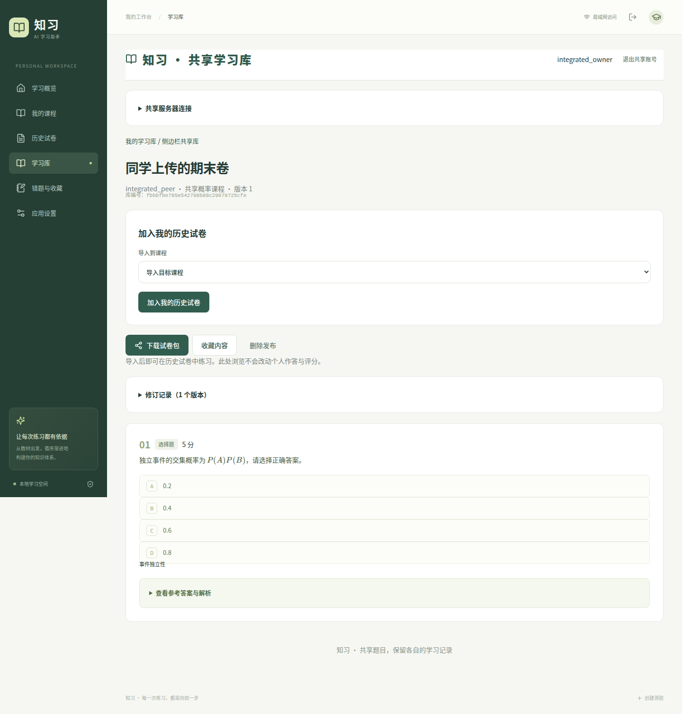

# 共享学习库：使用与部署

本机学习库已内置到个人端，启动项目即可使用，无需配置服务器。互联网共享服务仍可独立部署，在 **连接远程学习库（可选）** 中接入。登录共享账号后，用库编号和入库密码加入；旧邀请码继续兼容。支持发布试卷／错题包、浏览公式与答案、按标题／课程／发布说明搜索、收藏、下载、修订历史，以及创建者、管理员分级管理成员和下架内容。

个人学习助手仍在每位同学的电脑运行。共享库不提供 AI 出题，也不接收个人 API Key、原教材 PDF、作答、分数或错题标记。云端只存账号、学习库成员及主动发布的题目内容。**本版本提供了服务代码与部署配置，尚未部署到真实公网服务器。**



截图来自模拟数据浏览器测试。[查看手机页面](images/integrated-library-mobile.png)。

## 在个人端直接使用

1. 执行 `python start.py` 后进入左侧 **学习库**，默认显示“本机学习库已就绪”，可直接注册／登录，无需填写地址或另外启动服务。若此前保存了远程配置，仍保留原连接；想改用本机库时，点击 **使用本机学习库**。需要互联网共享时再展开 **连接远程学习库（可选）**，填写管理员提供的 HTTPS 网址。
2. 在学习库页注册／登录当前服务的学习库账号。本机库账号与远程服务账号分别保存。该账号与个人端启动口令独立，退出共享账号不会退出个人学习空间。用户名 3–32 位字母、数字或下划线，账号密码至少 10 位；若站点要求注册口令，注册时填写。
3. 创建学习库时设置至少 8 位的 **入库密码**，留空则自动生成。使用远程库时，将页面上的 **库编号＋入库密码** 和共享服务器网址发给同学。本机库的数据仅在当前电脑上，库编号和密码不会使另一台电脑自动看到它。密码只在创建时显示，不支持查看旧密码。其他同学连接同一个服务器、登录自己的共享账号后填写库编号和密码即可加入。也可填写 `https://共享服务器/?library=库编号` 形式的邀请链接，并另外输入密码；邀请链接不包含密码，不会自动切换已连接的服务器。
4. 在 **历史试卷** 列表或试卷页点击 **分享到学习库**，选择自己加入的库；页面会保留所选试卷。点击 **从历史试卷添加**，核对预览，填写发布说明，再确认发布。也可以直接进入库，从历史试卷下拉框选择。只分享已完成题目，不上传个人作答、成绩、API Key 或原教材。
5. 查看他人的试卷时，选择 **导入到课程**，点击 **加入我的历史试卷**。不指定课程则按试卷课程名称匹配或新建。导入后直接进入个人试卷页，可答题、自动评分／自行核分、收藏和打印。
6. 同一服务器、同一发布、同一版本默认只导入一份。再次查看显示 **打开已有副本**；需要重新练习的独立副本时选 **再创建一份**。网络重试不会重复创建同一次导入。
7. 发布者在库内 **上传修订版本 → 从历史试卷发布修订** 中选择修订后的本地卷，确认发布。旧版内容保留，已下载的副本不会自动改变。
8. 导入卷记录服务器、来源库、作者和版本。点击 **检查来源更新** 可检查新版本，再通过 **查看来源试卷** 核对并导入新版本；原有作答与成绩保留。来源被删除或成员资格被撤销后，已导入的个人副本仍可使用。

9. 删除库内试卷：在试卷列表卡片展开 **管理 → 从学习库删除**，或进入详情页点击同名按钮。仅发布者、创建者和管理员可见；确认后删除该发布及所有修订记录，个人历史试卷和已下载的副本不受影响。

原先的独立共享库网页和 JSON 文件上传／下载仍可使用：**导出试卷包 → 在共享网页上传 → 下载试卷包 → 个人端历史试卷导入**。单题和错题／收藏包可继续通过文件分享；错题／收藏导出当前筛选下的前 30 题。

此版本分享本项目格式的试卷／错题内容，**不支持 PDF/Word 教材共享，不包含共享服务器上的在线作答或实时协作编辑**。浏览和导入不调用 AI。个人端导入卷未附原教材，不支持重新生成或修改题目内容；需要修正时请发布者在原个人项目修改并发布新版本。题目和答案不因分享而自动获得正确性保证。

## 连接和密码规则

- **账号密码**用于登录共享账号；**入库密码**用于加入某个学习库；**站点注册口令**只限制新账号注册，三者用途不同。
- 创建者／管理员在 **成员与邀请码** 中可以重设入库密码。旧密码和旧邀请码立即失效，已加入成员保留。移除成员后，即使知道密码也不能重新加入，须先恢复成员资格。
- 不同库可以使用相同密码，系统通过库编号区分；密码使用独立盐和慢哈希保存。通过密码或邀请码加入都默认为普通成员。
- 旧学习库升级时会自动增加密码字段，原成员与旧邀请码保留；创建者／管理员可设置首次入库密码，无需重新建库。
- 本机库直接由主程序在进程内运行，不开放额外端口，不需要网络连接。数据库继续使用 `library-data/library.sqlite3`（可由 `LIBRARY_DATA_DIR` 指定），与原独立本机服务的默认位置一致，已有本机账号和发布无需迁移。
- 远程连接由个人端电脑后台发起，手机通过原有同 Wi-Fi 地址使用。共享服务器无需配置浏览器跨域规则。仅接受 HTTPS 服务，HTTP 仅允许 `localhost` / `127.0.0.1` / `::1` 本机测试地址；不跟随服务器重定向。
- 服务器连接和共享登录按个人端浏览器登录会话隔离。重新登录个人端、切换共享服务器或共享登录过期时可能需要重新登录共享账号。连接配置不保存账号明文密码；本机库在 `library-data/` 中保存密码哈希。后台保存必要的共享会话令牌用于后续请求，不返回浏览器脚本，也不上传本地访问口令。保护好本机 `data/`、`library-data/` 目录及备份。
- 个人端仍是单人工作空间，同一电脑上使用同一本地数据库的浏览器会看到相同课程和个人卷；不同同学应运行各自的个人端。共享账号不会把原个人端变成多用户成绩服务器。
- 可用环境变量 `LIBRARY_SERVER_URL` 为新的个人端登录会话预设远程服务器并自动使用；未设置时默认使用本机库。已有会话的远程配置不会自动替换。共享库连接使用直接网络访问，不继承出题用的代理环境变量。

## 三级角色与管理入口

每个学习库独立划分角色。同一个账号可以是甲库的管理员、乙库的普通成员；通过入库密码或邀请码加入时默认是普通成员。

| 操作 | 创建者 | 管理员 | 普通成员 |
| --- | --- | --- | --- |
| 查看资料、参考答案和修订历史 | ✓ | ✓ | ✓ |
| 上传、收藏、下载试卷／错题包 | ✓ | ✓ | ✓ |
| 修订或删除自己的发布 | ✓ | ✓ | ✓ |
| 删除他人的发布 | ✓ | ✓ | — |
| 移除／恢复普通成员 | ✓ | ✓ | — |
| 重设入库密码／更换邀请码 | ✓ | ✓ | — |
| 任命、取消或移除管理员 | ✓ | — | — |

创建者进入学习库，展开 **成员与邀请码**，点击成员旁的 **设为管理员**；之后可点击 **取消管理员**，将其恢复为普通成员。管理员不能变更创建者、其他管理员或自己的角色。创建者身份暂不支持转让或移除。

权限在服务端逐次核验，取消管理员或移除成员后，原有登录立即失去对应权限。恢复被移除的账号时先恢复为普通成员；如需管理员权限，由创建者另行任命。移除成员不会自动删除其发布，管理者可另外清理内容。删除发布也不会收回已经下载的副本。

已有学习库的原创建账号直接显示为“创建者”，原普通成员身份保留，无需重新建库或迁移数据。此处的“管理员”仅管理所属学习库，不等同于部署服务器的站点运维人员。

## 先在本机试用

日常使用只需在项目根目录执行：

```bash
python start.py
```

打开原来的个人端网址（通常是 `http://localhost:8000`），点击左侧 **学习库** 即可。首次进入直接注册账号，再创建库、从历史试卷添加内容。无需第二个终端、8001 端口或服务器地址；手机仍通过个人端的同 Wi-Fi 地址访问。本机模式不等于公网共享，各自电脑的数据不会自动同步。

已有远程配置且连接失败时，点击 **使用本机学习库** 可切换。该操作不删除远程服务器上的资料；原远程网址仍可通过可选连接入口重新接入。本机库和个人资料分别在 `library-data/`、`data/`，均被 Git 和 Docker 构建上下文忽略。

若需单独测试独立共享网页（可选），仍可运行：

```bash
LIBRARY_COOKIE_SECURE=false .venv/bin/python -m uvicorn backend.library.main:app --host 127.0.0.1 --port 8001
```

`LIBRARY_COOKIE_SECURE=false` 仅用于独立服务的本机 HTTP 测试；公网使用下述 HTTPS 部署。只部署共享服务时安装 `requirements-library.txt` 即可，不需要 PDF/OCR 依赖。

## 准备服务器与域名

适合先给一个学习小组使用。可从 Linux、约 2 GB 内存的小型服务器起步；实际容量取决于使用人数、题目长度和访问量。前端构建也需要内存，不能据此保证承载人数。服务器安装 Docker Engine 和 Compose 插件；准备一个域名或子域名，将其 A 记录指向服务器公网 IPv4。若设置 AAAA，也必须指向实际可访问的 IPv6 地址。

开放 TCP 80、443，SSH 端口按服务器设置管理。应用的 8001 端口仅在 Docker 内网供 Caddy 使用，不直接映射到公网。不要将个人端的 8000 端口或 `data/` 目录用于此部署。

是否需要备案取决于服务器所在地和服务商要求，购买时按服务商说明办理。

## 使用 Docker Compose 上线

在服务器克隆项目后：

```bash
git clone https://github.com/e2219/Self-learning-test.git
cd Self-learning-test
cp deploy/library.env.example .env.library
```

编辑 `.env.library`：

- `LIBRARY_DOMAIN` 填实际域名，例如 `study.your-domain.com`，不含协议或路径。
- `LIBRARY_REGISTRATION_CODE` 建议改成自己的长随机注册口令，仅发给需要注册的同学；留空则允许任何人注册，但仍须持库编号＋入库密码或邀请码才能加入和查看内容。

然后启动：

```bash
docker compose --env-file .env.library -f deploy/compose.library.yml up -d --build
docker compose --env-file .env.library -f deploy/compose.library.yml ps
docker compose --env-file .env.library -f deploy/compose.library.yml logs --tail=100
```

Caddy 会申请并续期 HTTPS 证书。DNS 和 80/443 可达后，打开 `https://你的域名`。如果无法签发证书，先检查域名解析、安全组和 Caddy 日志。请勿把密码、注册口令或完整环境配置贴到公开 issue。

个人端与共享服务器都需更新到支持直接接入的版本，旧服务器连接时会提示升级。

第一次注册不会自动成为其他学习库的管理员；每个学习库由其创建者管理。账号密码使用独立盐哈希，共享服务器上的登录令牌只保存哈希；个人端作为客户端保存自己的共享会话令牌。Cookie 默认仅经 HTTPS 发送，修改密码会使该账号全部旧会话失效。

容器以普通用户运行。共享库使用 SQLite 和一个应用 worker；不要将同一数据库挂载给多个应用副本，也不要增加 workers。当前提供的是小组使用版本，并非经过压测的大规模社区服务。

## 升级与备份

更新代码前备份，然后：

```bash
git pull --ff-only
docker compose --env-file .env.library -f deploy/compose.library.yml up -d --build
```

数据保存在 Compose 的 `library_data` 命名卷中，普通重新构建不会删除。**不要使用 `docker compose down -v`，它会删除命名卷。**

一致性备份可以先停止应用再复制数据库：

```bash
docker compose --env-file .env.library -f deploy/compose.library.yml stop library
mkdir -p backups
docker compose --env-file .env.library -f deploy/compose.library.yml cp library:/var/lib/zhixi-library/. backups/library-data
docker compose --env-file .env.library -f deploy/compose.library.yml start library
```

每次备份使用新的空目录，保留 SQLite 数据库及可能存在的 `-wal`、`-shm` 文件。恢复时停止应用，把同一批备份文件恢复到该数据卷，确保容器用户 UID 10001 有读写权限后再启动。备份包含账号哈希和分享内容，应只保存在受控位置。实际恢复应先在独立测试实例验证。

忘记密码时，服务器管理员可以在终端交互式重设账号密码：

```bash
docker compose --env-file .env.library -f deploy/compose.library.yml exec library python -m backend.library.admin 用户名
```

密码不会作为命令参数或输出显示，原登录会话同时失效。未提供邮件找回功能。

## 当前限制与核验范围

- 每份试卷包最多 30 题、2 MB；HTTP 请求最多 3 MB。仅接受规定字段，带个人评分、文档路径或额外配置的包会被拒绝。
- 每账号最多创建 10 个学习库；每库最多 200 个成员记录、1000 份发布；每份最多 20 个修订版本。列表每页 50 条。这些是边界限制，不是性能容量承诺。
- 注册、登录、猜测邀请码和发布设有服务端频率限制。多人共用同一出口 IP 时，注册／登录限制也会合计。
- 共享库不调用 DeepSeek，上传、查看、收藏、下载不产生模型 token 费用。服务器和域名仍有各自费用。
- 自动化测试使用临时数据库与模拟个人端出题，覆盖不同账号权限、移除成员、旧邀请码失效、修订冲突、内容版本、导入后个人成绩隔离和手机尺寸。
- 当前开发环境没有 Docker，因此未实测容器构建、Caddy 证书签发及真实公网部署；Python 服务、前端生产构建和浏览器完整流程另行验证。上线后应先用少量账号完成一次真实邀请、上传、下载、备份恢复试用。
